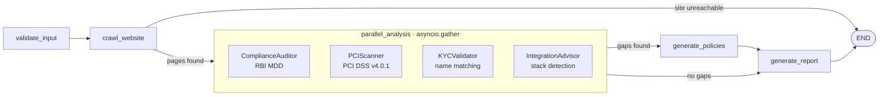

# Merchant Compliance Intelligence Engine

**Razorpay AI Buildathon 2026 · Track 05, Open Track**

A merchant applies for a payment gateway and gets rejected. Not for fraud, but because their site
has no refund policy page, or because their PAN says "Pvt. Ltd." and their bank account says
"Private Limited". They fix one thing, reapply, and get rejected for the next. Nobody tells them
the whole list up front.

MCIE runs the whole list before they apply. Give it a website and the business name as it appears
on three documents. Seven agents audit the site against RBI Merchant Due Diligence and PCI DSS
v4.0.1, compare the names, and return a graded report where **every finding names the rule that
produced it**. Where a policy is missing it writes one. Where an integration is needed it hands
over working Razorpay code for the stack it detected.


---

## Run it in two minutes

```bash
git clone https://github.com/khichar-monika15/merchant-compliance-engine
cd merchant-compliance-engine
uv sync && uv run playwright install chromium

uv run python test-sites/serve.py &          # four synthetic merchant sites
cd frontend && npm install && npm run build && cd ..
uv run uvicorn backend.main:app --port 8000  # http://localhost:8000
```

Sign in with `demo@mcie.dev` / `demo1234`, then use a demo button on the scan form. **No API key
is needed for any of this.** Every score in the report is produced by rules; the model refines
policy quality when a credential is present and the report says which path it took.

```bash
uv run pytest backend/tests/                       # 562 tests, no credentials needed
uv run python -m backend.tests.validate_ground_truth   # 4/4 against recorded expectations
```

<details>
<summary>Dev mode with hot reload</summary>

```bash
uv run uvicorn backend.main:app --reload --port 8000
cd frontend && npm run dev   # http://localhost:5173
```
</details>

---

## What makes it more than a wrapper

**The rules live in files, not in the model.** All twelve checks are declared in
`backend/knowledge/*.json`. A public [`/checks`](docs/screenshots/checks.jpg) page renders them
from the same loader the agents use, so the documentation cannot drift from the behaviour.

**A test fails the build if a declared rule stops being applied.** This is the discipline the
project is built around, and it was earned: a code review found a check declaring a scoring rule
that the scorer never read. The guard that prevents it walks every key in every knowledge file and
forces the author to name the module that honours it.

**Where the guard cannot reach, the guard is behavioural.** Two checks in the same file both
declared a key called `requirement`, so one satisfied the other's read while four security header
rules were enforced by nothing. A text search cannot tell those apart. So for every header the
checklist declares, a test breaks that header and asserts the score drops by exactly the points
declared for it.

**The model is used where judgement helps and nowhere else.** It rates whether a policy is
substantive or boilerplate, and it drafts replacements. Every score it touches has a rule-based
fallback, which is why the whole engine runs correctly with no credential at all. Crawling,
name matching, header grading and script classification are deterministic, because they should be.

**Every scan carries an audit trail.** Which agent ran, what it found, how long it took. Nothing
in the score is unexplained.

---

## Architecture

Supervisor-worker on a LangGraph `StateGraph`. The four independent analysers run concurrently
inside one node via `asyncio.gather()`, which keeps the graph linear and avoids LangGraph 0.2's
fragile fan-out/join convergence.



Every agent exports `async run(state) -> dict` returning only the keys it changed, so each is
independently testable. An agent that raises is caught, recorded in `errors` and the audit log,
and does not block the others.

### Scoring

| Axis | Weight | Source |
|---|---|---|
| RBI compliance | 40% | Applicable checks in `rbi_mdd_checklist.json`. Five for every merchant, plus RBI-007 shipping for those who deliver goods. RBI-006 name consistency is scored under KYC |
| KYC consistency | 25% | How many of the three document pairs agree after normalisation |
| PCI DSS surface | 20% | Four of the five checks in `pci_dss_surface_checks.json` carry points. PCI-003 classifies every third-party script and raises warnings, notably session recorders that can capture card entry, without taking points from the others |
| Integration readiness | 15% | Stack detected plus starter code, with a live test order as a bonus |

Grades: A ≥ 90, B ≥ 75, C ≥ 50, D ≥ 25, F below.

---

## The assistant


A merchant who reads "PCI: CSP header missing" and does not know what a Content Security Policy is
gets nothing from the report. The chat panel closes that gap.

It is handed a digest built from `backend/knowledge/*.json` plus, when a report is open, that
merchant's own findings. Answers drawn from the knowledge base cite the check id, and the response
carries those ids separately so the panel can badge them. **An id the knowledge base does not
declare is filtered out rather than rendered**, so a model that invents `PCI-009` cannot make it
look like a citation.

It answers wider questions too, and says when it is doing so. That is why the panel carries a
disclaimer and why the badges matter: they separate "this is your RBI-001 finding" from the model
talking. This is the one part of MCIE that needs a credential, and with none configured it says so
plainly rather than dressing an apology up as an answer.

---

## Verification

Four synthetic merchant sites with deliberately planted gaps, so the demo is repeatable and the
engine's discrimination is measurable.

| Site | Port | Stack | Score | Grade | Planted gaps |
|---|---|---|---|---|---|
| FreshKart India | 4001 | static HTML | 19 | F | No policy pages, 18 third-party scripts of which 15 count against SRI, GSTIN only in an HTML comment, KYC mismatches |
| QuickBites Delivery | 4002 | Nuxt | 26 | D | Thin boilerplate privacy policy, no refund or T&C, US registered office, no GSTIN, KYC mismatches |
| CloudDesk SaaS | 4003 | Next.js | 56 | C | Refund and privacy pages are 40-60 word stubs, no T&C, no GSTIN |
| Artisan Weaves | 4004 | Shopify | 86 | B | Nearly compliant, policies substantive but not exhaustive, GSTIN shown, KYC clean, missing a CSP header |

`validate_ground_truth` compares a live scan of all four against recorded expectations and exits
non-zero on failure. **CI runs it on every push**, with a real browser, on a clean machine.

Measured on both scoring paths against `qwen.qwen3-32b`: FreshKart 19 F either way, QuickBites 26
then 27, CloudDesk 56 then 58, Artisan 86 then 84. No grade moves, and the recorded bounds hold on
both. The harness prints which path a run actually took, says so when a configured provider is
unreachable, and asserts the exact recorded score only on the deterministic path.

`test-sites/serve.py` reads each site's `vercel.json` and sends the headers it declares. Do not use
`npx serve`: it ignores that file, so all four sites report every header missing and a quarter of
the PCI score becomes a property of how you served the site rather than of the site.

---

## What broke, and what it changed

The buildathon asks what broke. These are the four that changed how the project is built.

**Rules that were declared and never applied.** A check declared a scoring rule the scorer never
read. The question was not how to patch it but how many more there were, and the answer was: a
lot, in every file. That produced the guard described above, and then the discovery that the guard
could not see same-file key collisions, which produced the behavioural guard.

**A test suite that finished too fast to have run.** 205 tests passing in 5.93 seconds looked like
good news. Four of them crawl real sites with a real browser, and four browser crawls cannot finish
in six seconds. CI was never installing Chromium, so every browser test passed down the exception
path. The ground-truth script had the same shape of problem: it printed "4/4 passed" and never
called an exit code, so it returned success even when every site failed.

**The serving method was deciding a quarter of the security score.** Serving the test sites with a
server that ignores `vercel.json` meant all four reported every header missing, and the two PCI
header checks could not tell a well configured site from a bare one. Fixing it immediately exposed
another bug: one framework was being detected by two generic security headers that any careful
site sends, so a site was identified as two frameworks at once. That rule had never been able to
fire, so nobody had noticed it was wrong.

**Bugs that only appeared when measured rather than reasoned about.** The report generator returned
the whole accumulated audit log into a channel that appends, so the final state carried every agent
twice while the report itself stayed correct. Input validation computed errors that nothing acted
on, so three blank names produced a fully graded report whose name check compared blank to blank
and called it a match.

The habit that came out of it: every fix has a test, and every test is broken on purpose and
watched to fail before it is trusted.

---

## API

| Endpoint | Purpose |
|---|---|
| `GET /api/health` | Liveness |
| `GET /api/knowledge` | Every rule the engine applies, from the files the agents load. Backs `/checks`. No auth |
| `POST /api/scan` | Start a scan. Returns `{job_id, status}` |
| `GET /api/scan/{job_id}` | Poll status, fetch the report when complete |
| `WS /ws/scan/{job_id}` | Live agent progress. Replays history on connect |
| `POST /api/assistant` | Ask about a report. Returns the answer plus `cited_checks` |

Interactive docs at `/docs`.

## Configuration

Everything is optional. With no `.env` the engine runs end to end and records that the model was
unavailable.

| Variable | Purpose |
|---|---|
| `OPENAI_API_KEY` + `OPENAI_BASE_URL` + `LLM_MODEL` | OpenAI-compatible endpoint. The default path |
| `ANTHROPIC_API_KEY` + `ANTHROPIC_MODEL` | Anthropic direct. Used when the `OPENAI_*` vars are empty |
| `RAZORPAY_KEY_ID` + `RAZORPAY_KEY_SECRET` | Test-mode keys. Without them the live test order fails and integration scores 70 instead of 100; scans are unaffected |
| `CRAWLER_TIMEOUT`, `CRAWLER_MAX_PAGES` | Crawl budget. Defaults 30s and 20 pages |
| `ALLOW_LOOPBACK_SCANS` | The demo sites are on loopback, so this defaults on. Turn it off in a deployment |

## Tech stack

Python 3.12, FastAPI, LangGraph 0.2.60, Playwright, SQLite. React 18, TypeScript, Tailwind, Vite,
Zustand. Razorpay Python SDK in test mode. AWS Bedrock or Anthropic for the model, both optional.

## Known limitations

- **The four test sites are ones we wrote.** The numbers show the engine discriminates between
  compliance levels. They are not a claim about accuracy on real merchant websites, which has not
  been measured.
- Ground truth is recorded on the deterministic path so it reproduces on a clean clone. With a
  model configured, policy quality can move a point or two.
- Generated policies are drafts for a merchant to review, not legal advice.
- A site with no checkout or cart page has its headers graded on the homepage.
- `verify_payment_signature` is written and tested but not wired to a webhook route, because there
  is no webhook route yet.
- The assistant needs a model. Everything else does not.
- Accounts are a demo shell held in the browser tab, and the API is unauthenticated. The UI says so
  with a "Demo mode" badge rather than implying otherwise.
