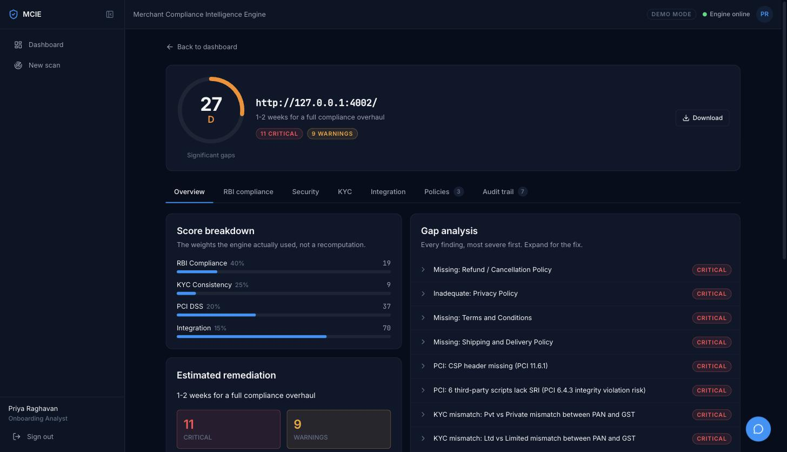
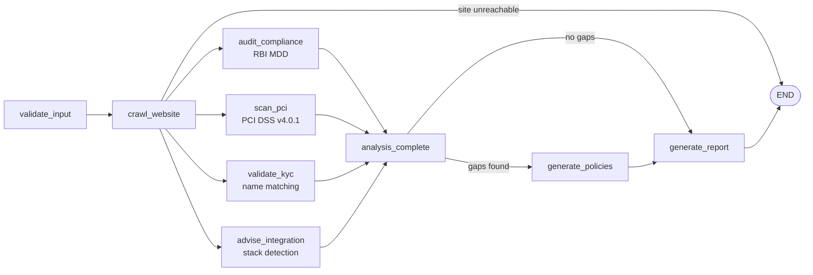
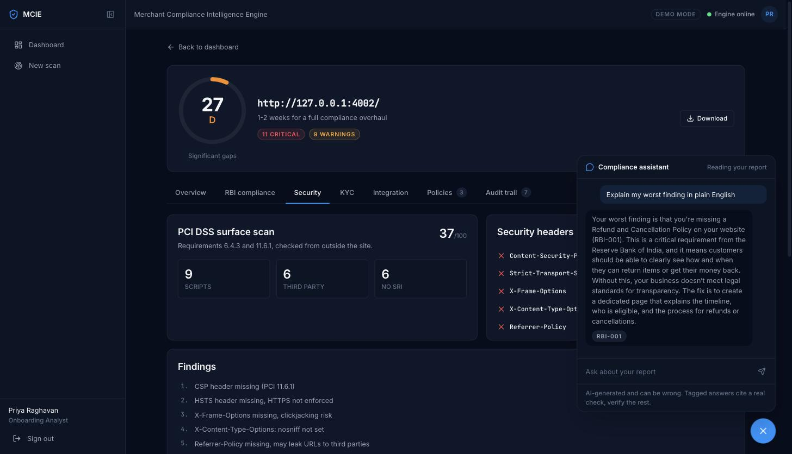

# Merchant Compliance Intelligence Engine

**Razorpay AI Buildathon 2026 · Track 05, Open Track**

A merchant applies for a payment gateway and gets rejected. Not for fraud, but because their site
has no refund policy page, or because their PAN says "Pvt. Ltd." and their bank account says
"Private Limited". They fix one thing, reapply, and get rejected for the next. Nobody tells them
the whole list up front.

MCIE runs the whole list before they apply. Give it a website and the business name as it appears
on three documents. Seven agents audit the site against RBI Merchant Due Diligence and PCI DSS
v4.0.1, compare the names, and return a graded report where **every finding names the rule that
produced it**. Where a policy is missing it writes one. Where an integration is needed it hands
over working Razorpay code for the stack it detected.



---

## Run it in two minutes

```bash
git clone https://github.com/khichar-monika15/merchant-compliance-engine
cd merchant-compliance-engine
uv sync && uv run playwright install chromium

uv run python test-sites/serve.py &          # four synthetic merchant sites
cd frontend && npm install && npm run build && cd ..
uv run uvicorn backend.main:app --port 8000  # http://localhost:8000
```

Sign in with `demo@mcie.dev` / `demo1234`, then use a demo button on the scan form. **No API key
is needed for any of this.** Every score in the report is produced by rules; the model refines
policy quality when a credential is present and the report says which path it took.

```bash
uv run pytest backend/tests/                       # 599 tests, no credentials needed
uv run python -m backend.tests.validate_ground_truth   # 4/4 against recorded expectations
```

<details>
<summary>Dev mode with hot reload</summary>

```bash
uv run uvicorn backend.main:app --reload --port 8000
cd frontend && npm run dev   # http://localhost:5173
```
</details>

---

## What makes it more than a wrapper

**The rules live in files, not in the model.** All twelve checks are declared in
`backend/knowledge/*.json`. A public [`/checks`](docs/screenshots/checks.jpg) page renders them
from the same loader the agents use, so the documentation cannot drift from the behaviour.

**A test fails the build if a declared rule stops being applied.** This is the discipline the
project is built around, and it was earned: a code review found a check declaring a scoring rule
that the scorer never read. The guard that prevents it walks every key in every knowledge file and
forces the author to name the module that honours it.

**Where the guard cannot reach, the guard is behavioural.** Two checks in the same file both
declared a key called `requirement`, so one satisfied the other's read while four security header
rules were enforced by nothing. A text search cannot tell those apart. So for every header the
checklist declares, a test breaks that header and asserts the score drops by exactly the points
declared for it.

**The model is used where judgement helps and nowhere else.** It rates whether a policy is
substantive or boilerplate, and it drafts replacements. Every score it touches has a rule-based
fallback, which is why the whole engine runs correctly with no credential at all. Crawling,
name matching, header grading and script classification are deterministic, because they should be.

**Every scan carries an audit trail.** Which agent ran, what it found, how long it took. Nothing
in the score is unexplained.

---

## Architecture

Supervisor-worker on a LangGraph `StateGraph`. The crawl fans out to four analyser nodes that run
in one superstep and converge on a join before the report is written. This diagram is the compiled
graph, not a drawing of one: a test asserts each analyser is its own node, that the crawl branches
to all four, and that none of them is a dead end.



Fan-out is safe here because the four never write the same channel: each owns one result key,
`audit_log` and `errors` carry `operator.add` reducers for the writes they share, and only the join
sets `current_phase`. Every agent exports `async run(state) -> dict` returning just the keys it
changed, so each is independently testable, and a node that raises is caught, recorded in `errors`,
and leaves the other three analyses in the report.

This used to be one node calling the four through `asyncio.gather()`, which was concurrent and
worked, but meant the architecture was narrated rather than built. The README defended it as
avoiding LangGraph 0.2's fragile fan-out convergence; that claim was never tested, and
`asyncio.gather` is in the first commit of the pipeline, so it predates any fan-out being
attempted. Converting it settled the question by measurement: fan-out converges correctly on the
pinned version, and ground truth did not move.

### Scoring

| Axis | Weight | Source |
|---|---|---|
| RBI compliance | 40% | Applicable checks in `rbi_mdd_checklist.json`. Five for every merchant, plus RBI-007 shipping for those who deliver goods. RBI-006 name consistency is scored under KYC |
| KYC consistency | 25% | Each of the three name pairs is normalised by rules RBI-006 declares, scored with RapidFuzz `WRatio`, then run past named mismatch detectors the same file declares: ampersand, abbreviation, spacing. A detector firing fails the pair **regardless of similarity**, which is how `Pvt. Ltd.` against `Private Limited` is caught at 95% similar, and the report names which pattern fired rather than just the score |
| PCI DSS surface | 20% | Four of the five checks in `pci_dss_surface_checks.json` carry points. PCI-003 classifies every third-party script and raises warnings, notably session recorders that can capture card entry, without taking points from the others |
| Integration readiness | 15% | Stack detected plus starter code, with a live test order as a bonus |

Grades: A ≥ 90, B ≥ 75, C ≥ 50, D ≥ 25, F below.

---

## The assistant



A merchant who reads "PCI: CSP header missing" and does not know what a Content Security Policy is
gets nothing from the report. The chat panel closes that gap.

It is handed a digest built from `backend/knowledge/*.json` plus, when a report is open, that
merchant's own findings. Answers drawn from the knowledge base cite the check id, and the response
carries those ids separately so the panel can badge them. **An id the knowledge base does not
declare is filtered out rather than rendered**, so a model that invents `PCI-009` cannot make it
look like a citation.

It answers wider questions too, and says when it is doing so. That is why the panel carries a
disclaimer and why the badges matter: they separate "this is your RBI-001 finding" from the model
talking. This is the one part of MCIE that needs a credential, and with none configured it says so
plainly rather than dressing an apology up as an answer.

---

## Verification

Four synthetic merchant sites with deliberately planted gaps, so the demo is repeatable and the
engine's discrimination is measurable.

| Site | Port | Stack | Score | Grade | Planted gaps |
|---|---|---|---|---|---|
| FreshKart India | 4001 | static HTML | 19 | F | No policy pages, 18 third-party scripts of which 15 count against SRI, GSTIN only in an HTML comment, KYC mismatches |
| QuickBites Delivery | 4002 | Nuxt | 26 | D | Thin boilerplate privacy policy, no refund or T&C, US registered office, no GSTIN, KYC mismatches |
| CloudDesk SaaS | 4003 | Next.js | 56 | C | Refund and privacy pages are 40-60 word stubs, no T&C, no GSTIN |
| Artisan Weaves | 4004 | Shopify | 86 | B | Nearly compliant, policies substantive but not exhaustive, GSTIN shown, KYC clean, missing a CSP header |

`validate_ground_truth` compares a live scan of all four against recorded expectations and exits
non-zero on failure. **CI runs it on every push**, with a real browser, on a clean machine.

Measured on both scoring paths against `qwen.qwen3-32b`: FreshKart 19 F either way, QuickBites 26
then 27, CloudDesk 56 then 58, Artisan 86 then 84. No grade moves, and the recorded bounds hold on
both. The harness prints which path a run actually took, says so when a configured provider is
unreachable, and asserts the exact recorded score only on the deterministic path.

`test-sites/serve.py` reads each site's `vercel.json` and sends the headers it declares. Do not use
`npx serve`: it ignores that file, so all four sites report every header missing and a quarter of
the PCI score becomes a property of how you served the site rather than of the site.

---

## What real websites broke

The four sites above are ones we wrote. They prove the engine discriminates between compliance
levels; they say nothing about whether it works on a site nobody designed for it. So we pointed it
at three live Indian D2C storefronts.

They are not named here. They did not ask to be assessed, and a compliance grade attached to a real
company's name is not ours to publish. The bugs are the point, and every one of them reproduces
against any site of the same shape.

The first scan returned nothing at all. Five bugs, in the order they were found:

**Waiting for silence that never comes.** `page.goto(wait_until="networkidle")` waits for 500ms of
network quiet. A real store with analytics, a chat widget and polling never has 500ms of quiet, so
`goto` spent the whole timeout and then discarded a page whose HTML had been ready for seconds.
Every synthetic site is static and goes idle instantly. That is the shape of all five: right in the
lab, wrong on the open web.

**Patterns that labelled but never looked.** Every check declares `url_patterns` like
`/refund-policy`. They were used only to classify links the crawler had already found. Real stores
link privacy and terms in the footer and leave refund and shipping to the checkout flow, so those
pages were never fetched, and the auditor graded whichever other page held two keywords, reporting
quality 1 for a policy that scores 6 when the right page is read.

**Link text outranking a URL.** One store sells "Return Gifts", party favours, at
`/collections/return-gifts`. That link text classifies as a refund policy, so a shopping category
was registered as the refund page and graded, and being registered it also stopped the search for
the real policy. A URL matching a declared pattern is stronger evidence than link text, and is now
treated as such.

**A rebrand emptying the whole crawl.** One site answers 301 to a different domain. The base domain
was pinned to what the merchant typed, so after the redirect every absolute link read as off-domain
and was discarded. Zero pages found, the auditor fell back to keyword matching, and the homepage was
graded as the refund policy. The site scored 52 and a C. A wrong answer in the generous direction is
worse than a failure, because it is the one a merchant will act on.

**One browser session grading skeletons.** Sharing a single browser context across the crawl, one
storefront returned its homepage at 1.6MB and then a 10KB, 26 word skeleton for every policy page
after it: it serves a client-routing shell to a session that already has the app loaded. The engine
graded those skeletons and called a good shipping policy quality 1. A fresh context per page
returned every page in full. Neither a 20 second settle nor an ordinary Chrome user agent changed
it, so this was the session, not rendering time and not being taken for a bot; the user agent stays
honest. This was also the source of run to run drift, the same site scoring 59 then 55 with shipping
quality 8 then 1 on the same URL, depending on which pages happened to arrive whole.

Each has a test that was watched failing first, and the synthetic ground truth did not move for any
of them. That is the point: these were failures the lab could not produce.

### Where it ended up

Three runs of each site, rule path, 30 August 2026. **Every score and every policy quality was
identical across all three runs of a site.** Before the session fix the same site scored 59 then 55,
with shipping quality 8 then 1 on the same URL, so reproducibility is the result here rather than an
assumption.

| Site | Score | Grade | Refund | Privacy | T&C | Contact | Shipping |
|---|---|---|---|---|---|---|---|
| Homeware and gifting, Shopify | 65 | C | 6 | 6 | 6 | 10 | 6 |
| Men's grooming, Shopify | 62 | C | 6 | 6 | 5 | 4 | 8 |
| Skincare, rebranded onto a new domain | 63 | C | 6 | 2 | 0 | 10 | 10 |

Two of those numbers were checked by hand rather than trusted, because both looked like the
generous-direction errors this engine had already been caught making.

The skincare site scores 10 for a shipping policy while publishing no shipping policy page. Reading
the page it graded settles it: the disclosure is a section headed "Shipping Policy" inside the refund
policy page, covering handling charges, dispatch in 1 to 4 business days, courier and tracking, and
delivery times by state. RBI-007 asks for delivery timelines, shipping charges and areas served, and
all three are published. The score is right, and it is exactly why the whole-site fallback was kept
after the homepage was excluded from it.

Its 0 for terms is a genuine miss in the safe direction: nothing links a terms page, no sitemap entry
matches, and no conventional URL answers, so the engine reports it missing rather than inventing it.

**What these numbers are not.** Three sites is enough to break a crawler and nowhere near enough to
calibrate a grade. All three landed in band C, which says more about mid-market Indian D2C storefronts
on Shopify than about the engine's resolution. And the KYC axis contributes a meaningless 100 to each
of them, because the same public legal name was typed into all three document fields; nothing on a
website can confirm what a PAN card says.

---

## What broke, and what it changed

The buildathon asks what broke. These are the four that changed how the project is built.

**Rules that were declared and never applied.** A check declared a scoring rule the scorer never
read. The question was not how to patch it but how many more there were, and the answer was: a
lot, in every file. That produced the guard described above, and then the discovery that the guard
could not see same-file key collisions, which produced the behavioural guard.

**A test suite that finished too fast to have run.** 205 tests passing in 5.93 seconds looked like
good news. Four of them crawl real sites with a real browser, and four browser crawls cannot finish
in six seconds. CI was never installing Chromium, so every browser test passed down the exception
path. The ground-truth script had the same shape of problem: it printed "4/4 passed" and never
called an exit code, so it returned success even when every site failed.

**The serving method was deciding a quarter of the security score.** Serving the test sites with a
server that ignores `vercel.json` meant all four reported every header missing, and the two PCI
header checks could not tell a well configured site from a bare one. Fixing it immediately exposed
another bug: one framework was being detected by two generic security headers that any careful
site sends, so a site was identified as two frameworks at once. That rule had never been able to
fire, so nobody had noticed it was wrong.

**Bugs that only appeared when measured rather than reasoned about.** The report generator returned
the whole accumulated audit log into a channel that appends, so the final state carried every agent
twice while the report itself stayed correct. Input validation computed errors that nothing acted
on, so three blank names produced a fully graded report whose name check compared blank to blank
and called it a match.

The habit that came out of it: every fix has a test, and every test is broken on purpose and
watched to fail before it is trusted.

---

## API

| Endpoint | Purpose |
|---|---|
| `GET /api/health` | Liveness |
| `GET /api/knowledge` | Every rule the engine applies, from the files the agents load. Backs `/checks`. No auth |
| `POST /api/scan` | Start a scan. Returns `{job_id, status}` |
| `GET /api/scan/{job_id}` | Poll status, fetch the report when complete |
| `WS /ws/scan/{job_id}` | Live agent progress. Replays history on connect |
| `POST /api/assistant` | Ask about a report. Returns the answer plus `cited_checks` |

Interactive docs at `/docs`.

## Configuration

Everything is optional. With no `.env` the engine runs end to end and records that the model was
unavailable.

| Variable | Purpose |
|---|---|
| `OPENAI_API_KEY` + `OPENAI_BASE_URL` + `LLM_MODEL` | OpenAI-compatible endpoint. The default path |
| `ANTHROPIC_API_KEY` + `ANTHROPIC_MODEL` | Anthropic direct. Used when the `OPENAI_*` vars are empty |
| `RAZORPAY_KEY_ID` + `RAZORPAY_KEY_SECRET` | Test-mode keys. Without them the live test order fails and integration scores 70 instead of 100; scans are unaffected |
| `CRAWLER_TIMEOUT`, `CRAWLER_MAX_PAGES` | Crawl budget. Defaults 30s and 20 pages |
| `ALLOW_LOOPBACK_SCANS` | The demo sites are on loopback, so this defaults on. Turn it off in a deployment |

## Tech stack

Python 3.12, FastAPI, LangGraph 0.2.60, Playwright, SQLite. React 18, TypeScript, Tailwind, Vite,
Zustand. Razorpay Python SDK in test mode. AWS Bedrock or Anthropic for the model, both optional.

## Known limitations

- **The four test sites are ones we wrote.** The numbers show the engine discriminates between
  compliance levels. They are not a claim about accuracy on real merchant websites. Three live
  storefronts were scanned to find the bugs above; three sites is enough to break a crawler and
  nowhere near enough to calibrate a grade.
- **KYC names are typed, and in production they would not be.** In a real onboarding flow all three
  are read from an authority rather than entered: the PAN name from the Income Tax verification API,
  the GST legal name from the GSTN API, and the bank account name from a penny drop, which is how
  [Razorpay itself confirms an account holder](https://razorpay.com/docs/api/x/account-validation/).
  All three need KYC-registered API access and commercial agreements, and the penny drop moves real
  money, so none was available here. Document upload with OCR was considered and rejected: it is the
  fallback for when no API exists, it reads about 96% where an API reads 99% and also proves the
  record exists, and a PDF can be edited in any image editor. So MCIE takes the strings and does the
  half that is real, which is the half that decides applications: normalising the names and naming
  which pairs disagree. That is the same comparison a verification API's name-match step performs on
  the values it fetched. The engine never claims to have verified a PAN, and the scan form says so.
- **So a real-site scan does not exercise KYC at all.** Passing the same public legal name three
  times scores a clean 100 that means nothing. The synthetic sites carry planted mismatches, which is
  the only place that axis is genuinely tested.
- **A policy the site publishes nowhere findable is reported missing.** Discovery reads the
  homepage links, the sitemap, and a list of conventional URLs. A policy that is none of those,
  reachable only from inside a checkout flow, will not be found. That is a false negative, and it
  is the direction we would rather fail in.
- Ground truth is recorded on the deterministic path so it reproduces on a clean clone. With a
  model configured, policy quality can move a point or two.
- Generated policies are drafts for a merchant to review, not legal advice.
- A site with no checkout or cart page has its headers graded on the homepage.
- `verify_payment_signature` is written and tested but not wired to a webhook route, because there
  is no webhook route yet.
- The assistant needs a model. Everything else does not.
- Accounts are a demo shell held in the browser tab, and the API is unauthenticated. The UI says so
  with a "Demo mode" badge rather than implying otherwise.
